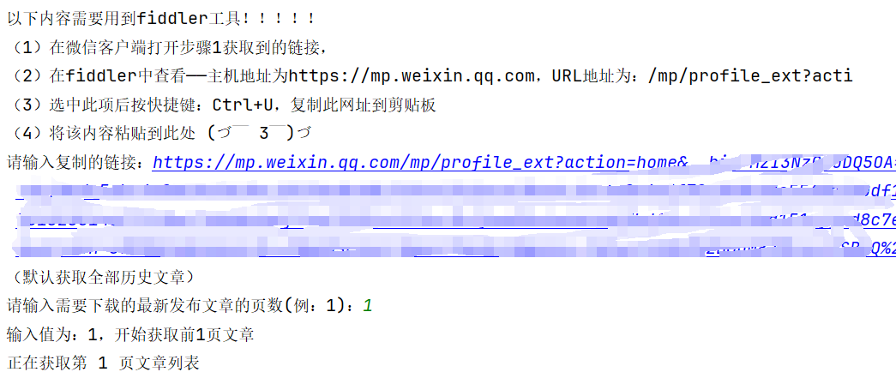
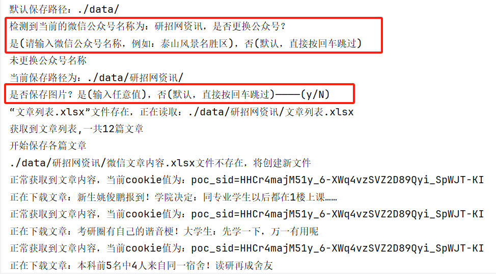
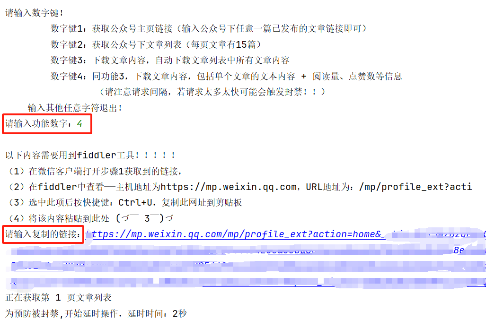

## 微信公众号/文章 获取（Access_wechat_article）

更新时间：2025年8月

````
先看这个！！！！！！！！！！！！！！！！！
其实这些功能键应该先运行数字键2，先生成all_data里面的公众号名称，
再运行其他的
数字键就不会出现这个报错了：
出现其他问题，请查找原因后再试！！！！
未获取到文章内容，请检查链接是否正确

################################
然后运行数字键4才会把读取到的数据存储在crawl_data数据库articles **相对应的表** 中
````
本项目是基于Python语言的爬虫程序，支持对微信公众号文章内容获取

目前支持 Windows / Linux 开箱即用，**建议使用虚拟环境运行项目**

如果感兴趣，请 **Fork** 项目后自行研究使用

使用过程中如遇到错误，欢迎提交 [issues](https://github.com/yeximm/Access_wechat_article/issues) 来讨论

**注**：请在 [GitHub](https://github.com/) 平台提交 [issues](https://github.com/yeximm/Access_wechat_article/issues)

## 一、主要功能

1. 获取**公众号主页链接**，通过微信内置浏览器可直接打开
2. 获取公众号**已发布**的文章列表（**微信公众号**下的历史文章）
3. 批量下载公众号文章的**网页文本数据**
4. 获取微信公众号文章的**所有信息**，如阅读量、点赞数、转发数、评论、评论点赞等信息。

---------
   这里是第二版的新加功能：
   该程序在爬取公众号文章信息后，会将数据存储在两个地方：
1. 本地文件夹（Excel文件）
存储路径：默认在程序目录下的 all_data/ 文件夹内。
结构：每个公众号会有一个以“公众号名称”命名的子文件夹（如 all_data/公众号----人民日报）。
内容：
文章列表（如：文章列表（article_list）_直连链接.xlsx）
文章内容（如：文章内容(article_contents).xlsx）
文章详情（如：文章详情（article_detiles）.xlsx）
问题链接（如：问题链接（error_links）.xlsx）
文章图片（如有下载图片，会有图片文件夹）
1. MySQL数据库
数据库名：crawl_data
表名：每个公众号一个表，表名格式为 articles_公众号名（如 articles_人民日报）。
内容：每篇文章的详细信息，包括发布时间、标题、链接、内容、阅读量、点赞数、评论等。

并且爬取成功后，在all_data文件夹下，每个公众号就会对应生成一个文件夹：

内含这4个表格，
##### 原始链接就是不能直接点开的链接（直接点开会让你验证登录）
##### 直连链接就是可以直接点开的，就能看到内容的链接
##### 文章详情就是有关文本的内容，内含文章正文以及点赞和评论等
##### 问题链接则是跟原始链接一样
---------

## 二、项目所需环境及工具

1. 系统环境：Windows 10 ×64
2. 程序运行环境：python 3.13
3. 涉及应用：微信**PC版**，当前项目已适配的微信版本：**`4.0.6.26`**
4. 使用工具：fiddler，当前项目适配的fiddler版本：**`v5.0.20253.3311`**

## 三、程序使用

### 3.1下载 / Download

- 下载地址：[https://github.com/yeximm/Access_wechat_article/releases](https://github.com/yeximm/Access_wechat_article/releases)
  - 👆👆👆以上为本项目发布页地址，选取所需版本下载即可。


- 存储库快照：[Github_master](https://github.com/yeximm/Access_wechat_article/archive/refs/heads/master.zip)
  - 存储库快照等同于 [Releases](https://github.com/yeximm/Access_wechat_article/releases) 中的 [Source Code (zip)](https://github.com/yeximm/Access_wechat_article/archive/refs/heads/master.zip) 等，包含 `README` 等内容

### 3.2 Python环境配置

（1）创建虚拟环境

```bash
python -m venv access_wechat
```

`venv`指定存放环境的目录，一般使用 `venv`，这是一个不成文的规定。

（2）**激活**环境

- Windows

  ```bash
  .\access_wechat\Scripts\activate
  ```

- Unix/macOS

  ```bash
  source access_wechat/bin/activate
  ```

（3）退出环境

```bash
deactivate
```

### 3.3 安装包文件

`requirements.txt`中包含所需python包文件名称，用来批量安装python包文件

安装命令：

```bash
pip install -r requirements.txt
```

### 3.4 运行参数

1. 项目主文件为：`main.py`，其功能调用方式详见于此。
   项目中**生成文件的存储路径**为：`./all_data`（该目录由程序**自动创建**）
2. 运行命令：
   
   1. 首先进入**虚拟环境**（详见**激活**虚拟环境）
   
   2. 安装python包文件（如已安装则进行下一步）
   
   3. 在项目目录运行：
   
      - ```bash
        python main.py
        ```
   
   4. 根据控制台提示输入
   
   5. 如需**自定义功能**，参照`main.py`中的函数调用方式自行编写。

## 四、功能截图

### 4.1 功能1


### 4.2 功能2




### 4.3 功能3




### 4.4 功能4



## 五、程序流程图


## 六、鼓励一下

开源不易，若此项目有帮到你，望你能动用你的小手**Star**☆一下。

如有遇到代码方面的问题，欢迎一起讨论，你的鼓励是这个项目继续更新的最大动力！


另外，十分感谢大家对于本项目的关注。


## LICENSE

本作品采用许可协议 <a rel="license" href="http://creativecommons.org/licenses/by-nc-sa/4.0/">Creative Commons Attribution-NonCommercial-ShareAlike 4.0 International</a> ,简称 **[CC BY-NC-SA 4.0](http://creativecommons.org/licenses/by-nc-sa/4.0/)**。

所有以任何方式查看本仓库内容的人、或直接或间接使用本仓库内容的使用者都应仔细阅读此声明。本仓库管理者保留随时更改或补充此免责声明的权利。一旦使用、复制、修改了本仓库内容，则视为您已接受此免责声明。

项目内容仅供学习研究，请勿用于商业用途。如对本仓库内容的功能有需求，应自行开发相关功能。所有基于本仓库内容的源代码，进行的任何修改，为其他个人或组织的自发行为，与本仓库内容没有任何直接或间接的关系，所造成的一切后果亦与本仓库内容和本仓库管理者无关。

本仓库内容中涉及的第三方硬件、软件等，与本仓库内容没有任何直接或间接的关系。本仓库内容仅对部署和使用过程进行客观描述，不代表支持使用任何第三方硬件、软件。使用任何第三方硬件、软件，所造成的一切后果由使用的个人或组织承担，与本仓库内容无关。

## Star History

[](https://www.star-history.com/#yeximm/Access_wechat_article&Date)

